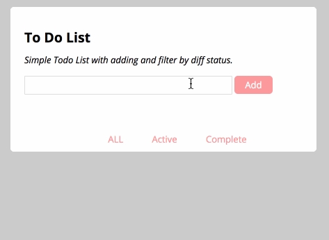

# to-do-list
### Function:
- enter something you need to do in the input box, then press enter or click the Add button, one task can be generated.
- when you complete one task, click the check box of it, the task will be grayed out and strikethrough.
- there're three buttons at the bottom of this page.
    
  - if you want to see all tasks you add,click the `ALL` .
  - if you just want to see tasks you haven't done, click the `Active` .
  - if you want to check tasks you have done, click the `Complete` .   

  **_attention: if you click the `Complete`,  you unable to add any task into the list_**
  
- when the mouse move to the line of any task, there will be a `×` on the right, click it and choose “确认” in the pop-up confirmation box if you really want to delete this task.

### Here's a demo:     
 
.